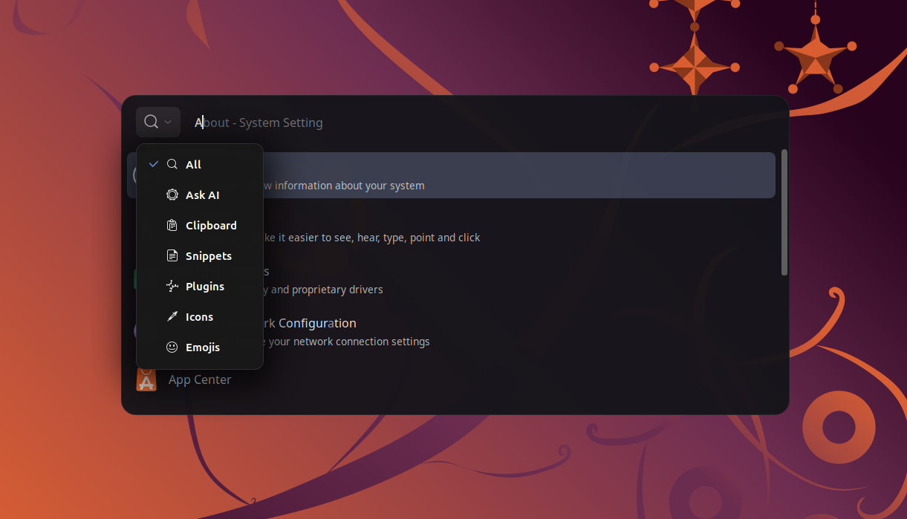
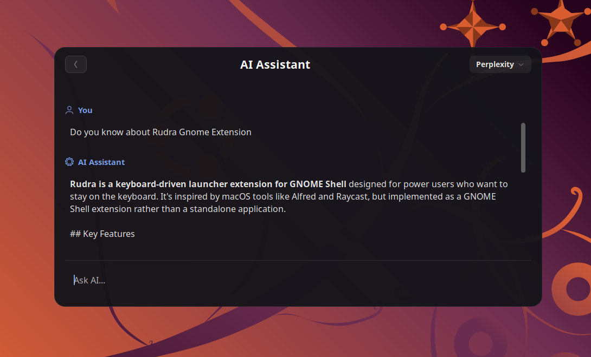

<div align="center">


# Rudra

**AI-powered keyboard launcher for GNOME Shell**

Instant access to AI assistants, clipboard history, snippets, files, and system commands - all from a single keystroke.

[](https://extensions.gnome.org/extension/9342/rudra/)
[](LICENSE)
[](https://github.com/sponsors/NarkAgni)

<br>

[Installation](#installation) · [Features](#features) · [Usage](#usage) · [Support](#support)

</div>

---

## Overview

Rudra is a modern, deeply integrated launcher designed to replace the default GNOME overview. it brings a full productivity suite to your desktop - from chatting with local and cloud AI models, to managing your clipboard, to executing custom Python/Bash plugins. Built for speed, minimalism, and deep customization.

<div align="center">
  
  <sub>The Launcher - Minimalist design with smart autocomplete</sub>
</div>

<br>

<div align="center">
  
  <sub>AI Assistant - Rich Markdown rendering, code highlighting, and provider switching</sub>
</div>

---

## Features

### AI Assistant - `?`

A fully-featured AI chat interface built directly into your desktop.

- **Multi-model support** - Switch between **Gemini**, **Groq**, **Ollama (local)**, **Perplexity**, and **Cohere** via a floating dropdown
- **Rich Markdown & Code** - Beautiful response formatting with language-tagged code blocks and a one-click "Copy Code" button
- **Chat History** - Conversations are auto-saved; pin favorites or delete old ones from search results

### Quick Web AI - `px` / `co`

Skip the full chat. Use `px` (Perplexity) or `co` (Cohere) triggers to fetch a concise, 2-line answer directly in the search bar. Press `Enter` to copy it to your clipboard instantly.

### Clipboard Manager - `cb`

Your clipboard history, without a separate extension.

- Browse and search recent clipboard entries
- **Inline editing** - Click the edit icon to modify copied text before pasting it again

### Snippet Manager - `!`

Store and reuse frequently-typed text, emails, and code blocks.

- Filter by color-coded tags
- Usage counts automatically surface your most-used snippets to the top

### Developer Plugins - `p`

Extend Rudra on the fly. Write, edit, and run custom **Python** or **Bash** scripts directly from the launcher.

### Emojis & Icons - `em` / `ic`

Browse system emojis and GNOME icons in a responsive grid view. Press `Enter` to copy.

### Universal Search & Web

Smart query routing based on prefixes:

| Prefix | Action |
|--------|--------|
| `.` | Search files in your home directory |
| `>` | Execute shell commands |
| `g` | Search Google |
| `yt` | Search YouTube |
| `ddg` | Search DuckDuckGo |
| `w` | Search Wikipedia |
| *(expression)* | Evaluate math - e.g. `(10 * 3) / 2` → press Enter to copy result |

### Deep Customization

Open **Rudra Settings** (search `rudra settings`) to access a modern LibAdwaita preferences window:

- Customize font family, text size, and UI width
- Remap all trigger keywords (e.g. change `?` to `ai`)
- Change the global toggle shortcut

---

## Usage

| Action | Shortcut |
|--------|----------|
| Toggle Launcher | `Ctrl + Shift + Space` *(customizable)* |
| Navigate results | `↑ / ↓` Arrow keys |
| Select / Run | `Enter` |
| Autocomplete | `Tab` or `→` |
| Close | `Esc` |

---

## Installation

### From GNOME Extensions *(recommended)*

<div align="center">

[](https://extensions.gnome.org/extension/9342/rudra/)

</div>

### From Source

**Requirements:** GNOME Shell 45–50 · `libglib2.0-bin`

```bash
# 1. Clone the repository
git clone https://github.com/NarkAgni/rudra.git
cd rudra

# 2. Install
make install

# 3. Restart GNOME Shell
#    On X11:     Press Alt+F2, type 'r', press Enter
#    On Wayland: Log out and back in

# 4. Enable the extension
gnome-extensions enable rudra@narkagni
```

```bash
# To uninstall
make uninstall
```

---

## Support

Rudra is free and open-source. If it boosts your productivity, consider supporting development:

<div align="center">

[](https://github.com/sponsors/NarkAgni)
&nbsp;
[](https://buymeacoffee.com/narkagni)

</div>

<details>
<summary><b>Crypto donations</b></summary>

<br>

| Network | Address |
|---------|---------|
| Bitcoin (BTC) | `1GSHkxfhYjk1Qe4AQSHg3aRN2jg2GQWAcV` |
| Ethereum (ETH) | `0xf43c3f83e53495ea06676c0d9d4fc87ce627ffa3` |
| Tether USDT (TRC20) | `THnqG9nchLgaf1LzGK3CqdmNpRxw59hs82` |

</details>

---

<div align="center">

Made with ❤️ by **[NarkAgni](https://github.com/NarkAgni)** · GPL-3.0

</div>

